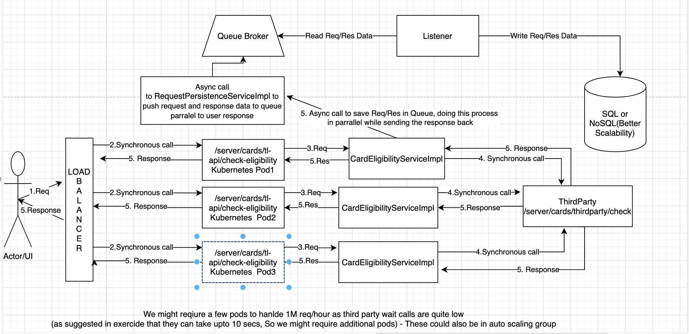
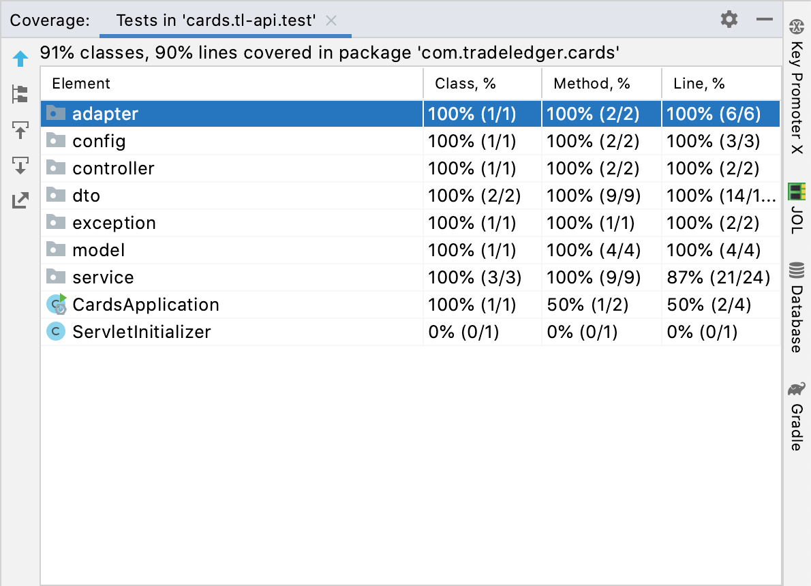

# Cards Application
## BackEnd 
###Calculations

- Considering 1 request will take 10 seconds to process in synchronous manner as suggested in the 
  test description.
- Now, How our TL service responds to these requests depends highly on the hardware, servers etc
  where the service is deployed. So considering server as Tomcat we can serve 200 requests per given second (with default number of threads).
  So, we might need to have few pods of this service available.
  1 tomcat (just for simlicity, a kubernestes pod will ofc have diff capabilities) can serve 200 requests / sec and for processing 1M request in first hour we need
  to process 1000000/(60*60)= 278 requests/second. And each of these requests could take upto
  10 seconds to receive a response. So lets say we have a strong Hardware , with 278 threads
  configured for Tomcat. We need minimum 10-11 such servers to be able to process this volume.
- We can orchestrate all these deployment pods with Kubernetes or maybe adding auto scaling groups.
- We have resolved the database bottleneck using Async service and Queue Message Brokers (RabbitMQ/Kafka).
  So, user won't have to wait until data is transferred to Queue and then persisted to DB using listeners.
- Using NoSQL to store the data due it's availability , scalability and the fact that we don't need
  any ACID properties or relation between tables.

### Backend Architecture

### Handled Edge Cases
  1. Error handling when third party api is down
  2. input validation - mandatory fields

### Test Coverage - BE

## FrontEnd

1. Added Field level validations on the page.
2. Upon submit response will be displayed i.e. number of cards or info message.
3. In case the third party api is down user will be given a message saying that "Oops! There have been an issue connecting to the servers , 
   Please try in a while".
4. Used Redux for state management.
5. Added back button functionality from results page.

###Further Improvements
I would have done below if I had more time and more knowledge on TypeScript
1. Routing (Like if user provides /result url directly , we redirect them back to Form page) 
2. Styling specially result page
3. Refresh page issue on result page.
4. UI tests (I couldn't complete this because I haven't really used typescript before, I mostly have used
   react JS ). So everything that I updated 
was just by learning , with redux added testing became more complicated and time-consuming.
