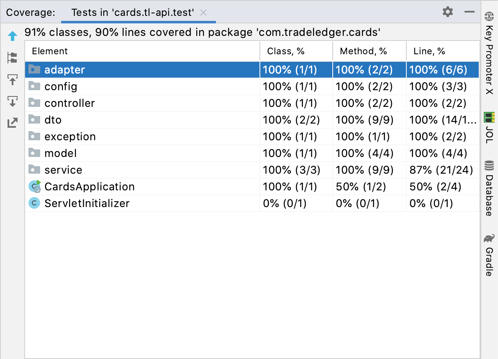

# Cards Application
## BackEnd 
###Calculations

- 1000000/(60*60)= 278 rps
- Considering 1 request will take 10 seconds to process in synchronous manner as suggested in the 
  test description.
- Given we need to process 1M request per hour - How TL service responds to request
  depends highly on the hardware where the service is deployed.
  So considering default behaviour and server(Tomcat) 
  , lets say we can serve 200 requests per given second (with default number of threads).
  So, we might need to have few pods of this service available.
  We can orchestrate all that with Kubernetes or maybe adding Auto scaling group on cloud infra.
- We have resolved the database bottleneck using Async service and queue. So, user won't need 
to wait until data is persisted to DB. More details in code and diagram.

### Backend Architecture

### Handled Edge Cases
  1. Error handling when third party api is down
  2. input validation - mandatory fields

### Test Coverage - BE

## FrontEnd

1. Added Field level validations on the page.
2. Upon submit response will be displayed i.e. number of cards or info message.
3. In case the third party api is down user will be given a message saying that "Oops! There have been an issue connecting to the servers , 
   Please try in a while".
4. Used Redux for state management.
5. Added back button functionality from results page.

###Further Improvements
I would have done below if I had more time and more knowledge on TypeScript
1. Routing (Like if user provides /result url directly , we redirect them back to Form page) 
2. Styling specially result page
3. Refresh page issue on result page.
4. UI tests (I couldn't complete this because I haven't really used typescript before, I mostly have used
   react JS ). So everything that I updated 
was just by learning , with redux added testing became more complicated and time-consuming.
